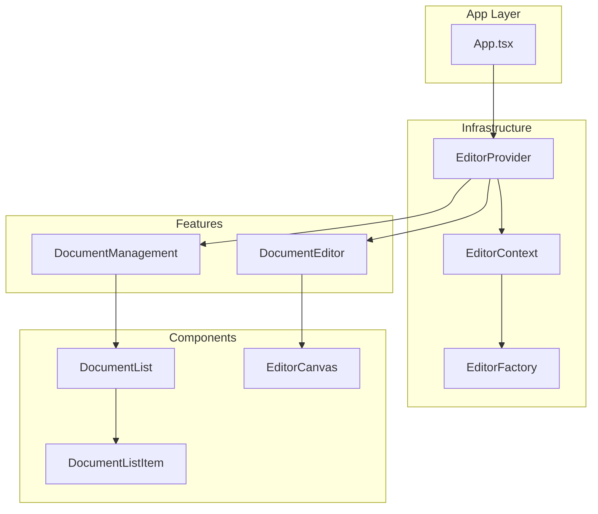
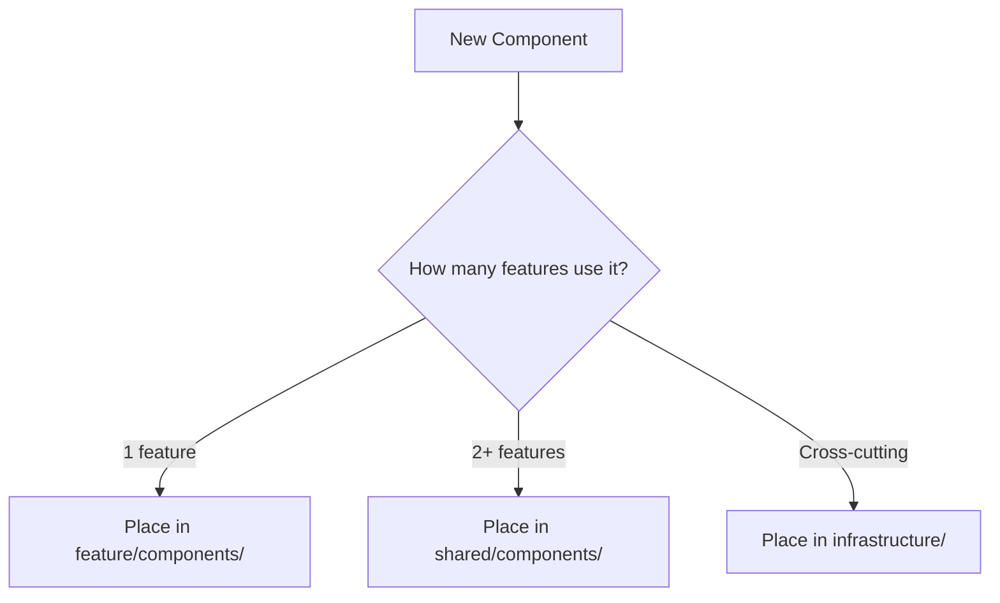
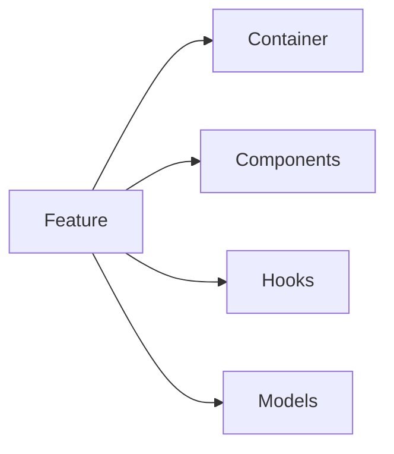
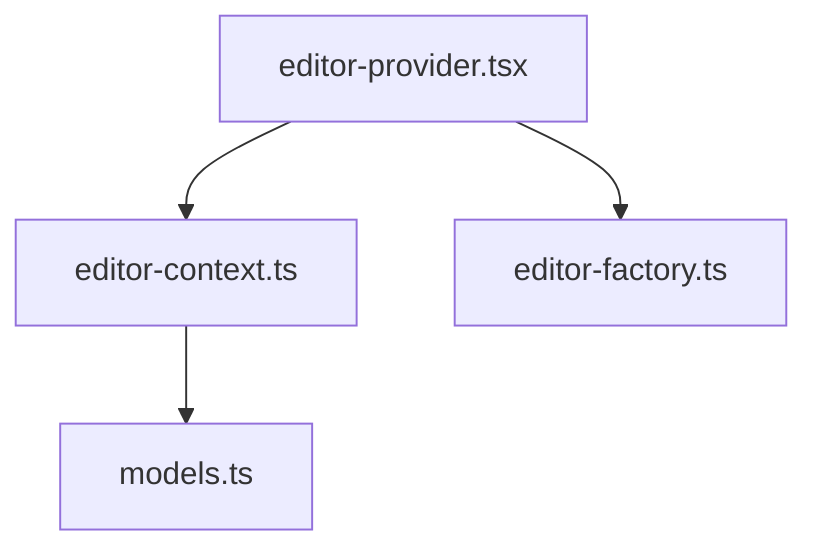

# Architecture

Architectural decisions and patterns for BlockSuite React.

---

**[← Back to README](./README.md)** | **[Structure →](./STRUCTURE.md)**

---

## Overview

This project follows two core architectural patterns:

1. **Scope Rule**: Component placement based on usage count
2. **Screaming Architecture**: Structure communicates business intent

### Architecture Diagram



---

## Scope Rule

**The Unbreakable Law**: Placement determined by usage count.

### Decision Matrix



### Current Placement

| Component | Usage | Location | Reason |
|-----------|-------|----------|--------|
| DocumentList | 1 | `features/document-management/` | Single feature |
| DocumentListItem | 1 | `features/document-management/` | Single feature |
| EditorCanvas | 1 | `features/document-editor/` | Single feature |
| EditorProvider | All | `infrastructure/editor/` | Cross-cutting |

---

## Feature Organization

### Container Pattern

Each feature has a main container matching its directory name:

```
features/
├── document-management/
│   └── document-management.tsx    ← Container
└── document-editor/
    └── document-editor.tsx        ← Container
```

### Feature Structure



**Rules:**
- Container name = Feature name
- Local components in `components/`
- Local hooks in `hooks/`
- Local types in `models.ts`

---

## Infrastructure Layer

Cross-cutting concerns that serve multiple features.

### Editor Infrastructure



**Responsibilities:**
- BlockSuite initialization
- Context management
- Editor instance creation
- Type definitions

---

## Decision Records

### DR-001: Why DocumentList is Local

**Decision**: Place in `features/document-management/components/`

**Rationale**: Used only by document-management feature (1 feature = local)

**Consequences**: If document-editor needs it, refactor to `shared/`

---

### DR-002: Why EditorProvider is Infrastructure

**Decision**: Place in `infrastructure/editor/`

**Rationale**: Cross-cutting concern, not business logic

**Consequences**: Both features depend on it, but it's not a feature itself

---

### DR-003: Path Aliases

**Decision**: Use `@features`, `@infrastructure`, `@shared`

**Rationale**: 
- Clear import intent
- Prevents relative path hell
- Enforces architectural boundaries

**Example:**
```typescript
// Good
import { DocumentManagement } from '@features/document-management/document-management';

// Bad
import { DocumentManagement } from '../../../features/document-management/document-management';
```

---

### DR-004: No Premature Shared

**Decision**: Start local, move to shared only when needed

**Rationale**: YAGNI principle - don't predict future reuse

**Process:**
1. Create component locally
2. Wait for second feature to need it
3. Then move to `shared/`
4. Document the move

---

## Refactoring Guidelines

### Moving to Shared

When a component is used by 2+ features:

1. Move file to `shared/components/`
2. Update all imports
3. Document in commit message
4. Update this architecture doc

### Adding New Features

```bash
# 1. Create feature directory
mkdir -p src/features/[feature-name]

# 2. Create container
touch src/features/[feature-name]/[feature-name].tsx

# 3. Create subdirectories as needed
mkdir src/features/[feature-name]/components
mkdir src/features/[feature-name]/hooks
```

---

## Anti-Patterns

### ❌ Don't Do This

```typescript
// Generic utils folder
src/utils/helpers.ts

// Technical grouping
src/containers/
src/presentational/

// Mismatched names
features/documents/
  document-list.tsx  ← Should be documents.tsx
```

### ✅ Do This

```typescript
// Domain-specific utilities
features/document-management/utils/document-helpers.ts

// Business grouping
features/document-management/
features/document-editor/

// Matched names
features/document-management/
  document-management.tsx  ← Matches directory
```

---

**Related**: [README](./README.md) | [Structure](./STRUCTURE.md)
