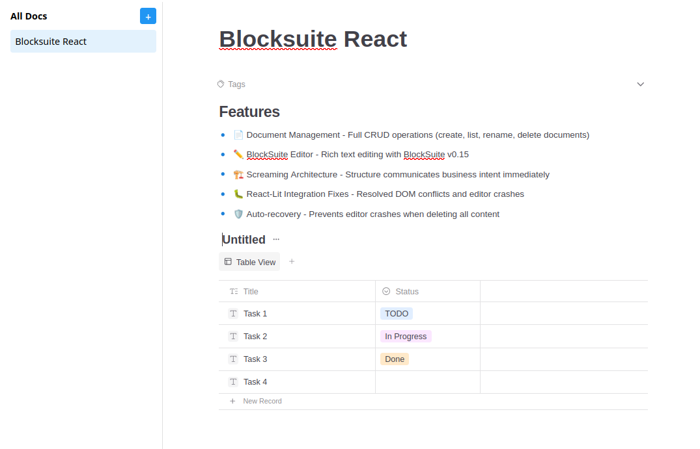
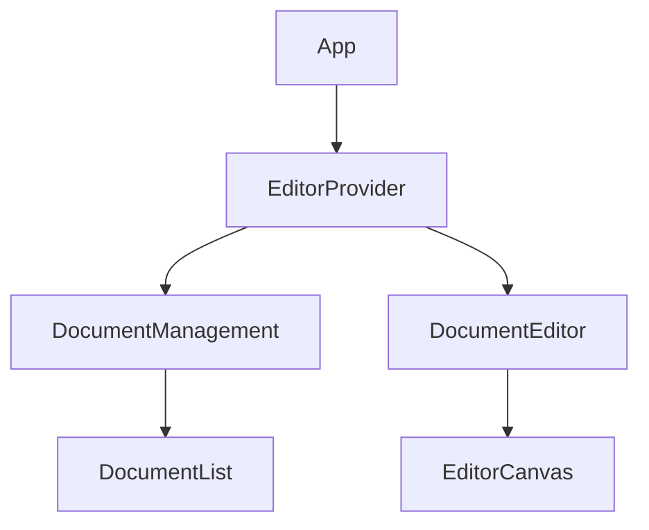

# BlockSuite React

Production-ready React implementation of BlockSuite editor with strict architectural patterns.



---

## Quick Start

```bash
pnpm install
pnpm dev
pnpm build
```

---

## Architecture

Follows **Scope Rule** pattern: 1 feature = local, 2+ features = shared.



---

## Structure

```
src/
├── features/              # Business features
│   ├── document-management/
│   └── document-editor/
├── infrastructure/        # Cross-cutting concerns
│   └── editor/
└── shared/               # 2+ feature reuse only
```

**Path Aliases:**
- `@features/*` → `src/features/*`
- `@infrastructure/*` → `src/infrastructure/*`
- `@shared/*` → `src/shared/*`

---

## Tech Stack

| Technology | Version |
|------------|---------|
| React | 18.3 |
| TypeScript | 5.4 |
| Vite | 5.2 |
| BlockSuite | 0.15.0 |

---

## Documentation

- **[Architecture](./ARCHITECTURE.md)** - Patterns and decisions
- **[Structure](./STRUCTURE.md)** - Visual organization guide

---

## License

MIT
