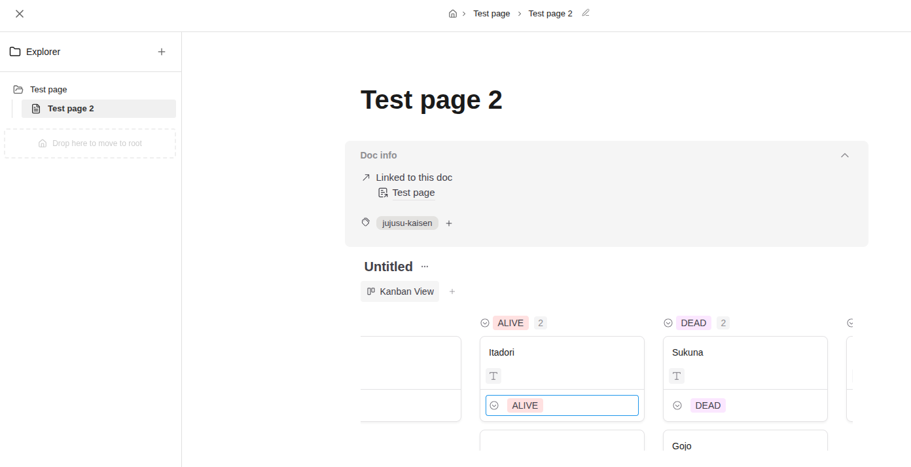
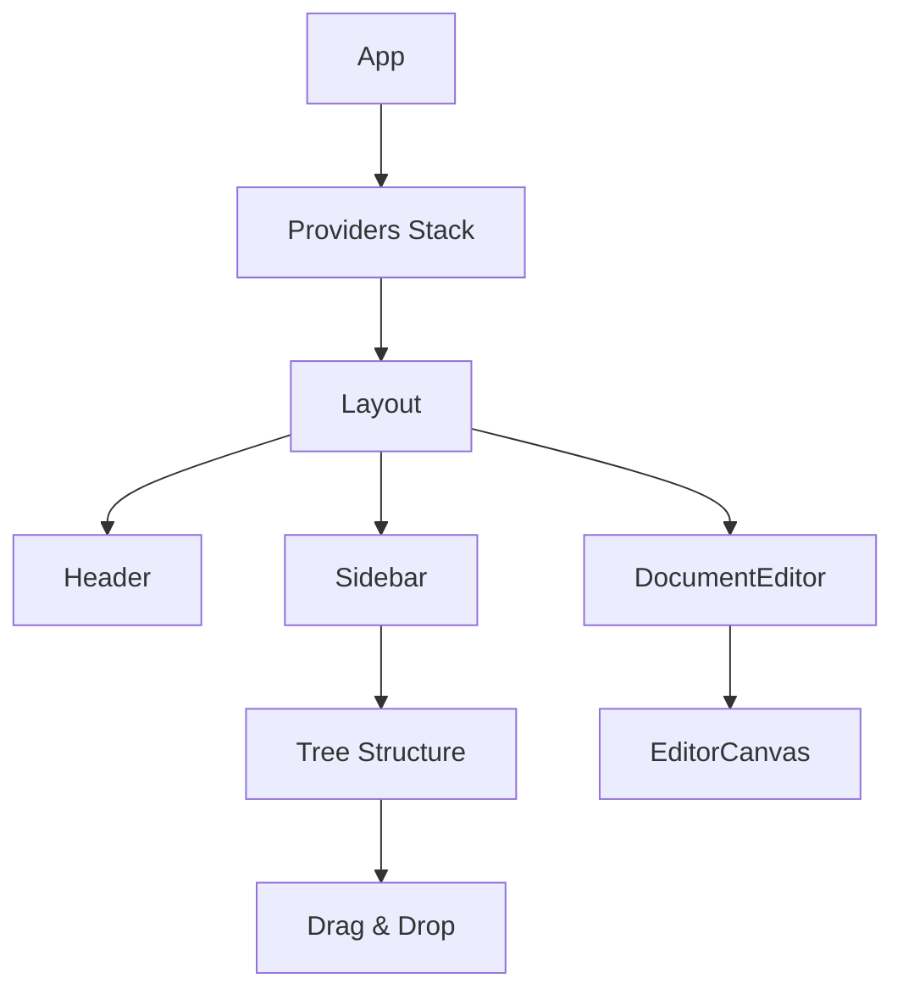

# BlockSuite React

Production-ready React implementation of BlockSuite editor with hierarchical document management and strict architectural patterns.



---

## Quick Start

```bash
pnpm install
pnpm dev
pnpm build
```

---

## Features

- ✅ **Hierarchical Documents** - Tree structure with up to 4 nesting levels
- ✅ **Drag & Drop** - Reorganize documents with visual feedback
- ✅ **CRUD Operations** - Create, rename, delete, and move documents
- ✅ **Internal Links** - Navigate between documents via editor links
- ✅ **Theme Support** - Light/dark mode with system preference detection
- ✅ **Responsive Layout** - Collapsible sidebar and full-width mode
- ✅ **Toast Notifications** - User feedback for all operations
- ✅ **Input Validation** - Sanitization and security checks
- ✅ **Browser Compatibility** - Automatic compatibility detection

---

## Architecture

Follows **Scope Rule** pattern: 1 feature = local, 2+ features = shared.



---

## Structure

```
src/
├── features/              # Business features
│   ├── document-management/
│   │   ├── components/    # DocumentList, DocumentListItem
│   │   ├── hooks/         # useDocuments, useDocumentManagementLogic
│   │   └── services/      # document-service, document-move-service
│   └── document-editor/
│       └── components/    # EditorCanvas
├── infrastructure/        # Cross-cutting concerns
│   └── editor/           # BlockSuite integration
├── shared/               # Multi-feature reuse
│   ├── components/       # Sidebar, Header, Layout, Modal, Toast
│   ├── contexts/         # Theme, EditorConfig, DocumentUpdate
│   ├── hooks/           # useToast, useModal
│   ├── providers/       # ToastProvider, ModalProvider
│   ├── utils/           # sanitize, validation
│   └── models/          # TypeScript types
└── styles/              # Global CSS
```

**Path Aliases:**
- `@features/*` → `src/features/*`
- `@infrastructure/*` → `src/infrastructure/*`
- `@shared/*` → `src/shared/*`

---

## Tech Stack

| Technology | Version | Purpose |
|------------|---------|---------|
| React | 18.3 | UI Framework |
| TypeScript | 5.4 | Type Safety |
| Vite | 5.2 | Build Tool |
| BlockSuite | 0.15.0-canary | Editor Engine |
| Lucide React | 0.562 | Icons |
| DOMPurify | 3.3 | HTML Sanitization |
| Biome | 2.3 | Linter/Formatter |

---

## Key Implementations

### Document Hierarchy
- Parent-child relationships via `parentId` metadata
- Maximum depth: 4 levels
- Circular reference prevention
- Auto-expand on child creation

### BlockSuite Integration
- Custom editor factory with AFFiNE schemas
- Title synchronization between metadata and editor
- **Critical Fix**: Auto-recreate paragraph on full content deletion (BlockSuite v0.15 bug)
- Internal link navigation via `docLinkClicked` slot

### Security
- HTML sanitization with DOMPurify
- Input validation for titles and IDs
- XSS prevention on user-generated content

---

## Documentation

- **[Architecture](./ARCHITECTURE.md)** - Patterns and decisions
- **[Structure](./STRUCTURE.md)** - Visual organization guide

---

## Development

```bash
# Install dependencies
pnpm install

# Start dev server
pnpm dev

# Build for production
pnpm build

# Lint and format
pnpm lint
pnpm lint:fix
pnpm format

# Preview production build
pnpm preview
```

---

## License

MIT

---

## Credits

Built with [BlockSuite](https://github.com/toeverything/blocksuite) - A toolkit for building editors and collaborative applications.

**BlockSuite Resources**:
- [Documentation](https://blocksuite.io)
- [API Reference](https://blocksuite.io/api)
- [AFFiNE](https://github.com/toeverything/AFFiNE) - Production app using BlockSuite

