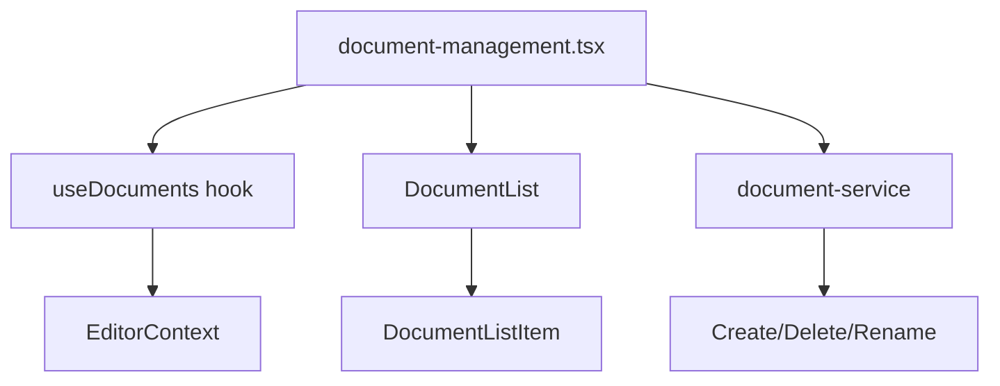
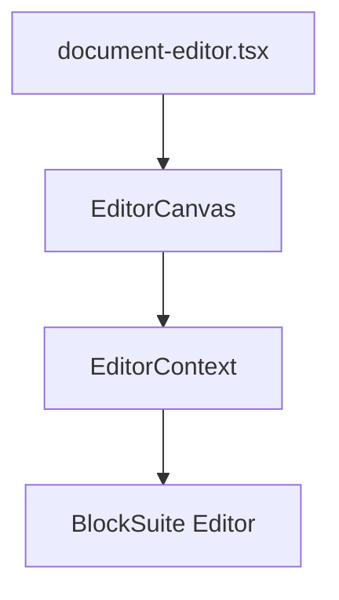
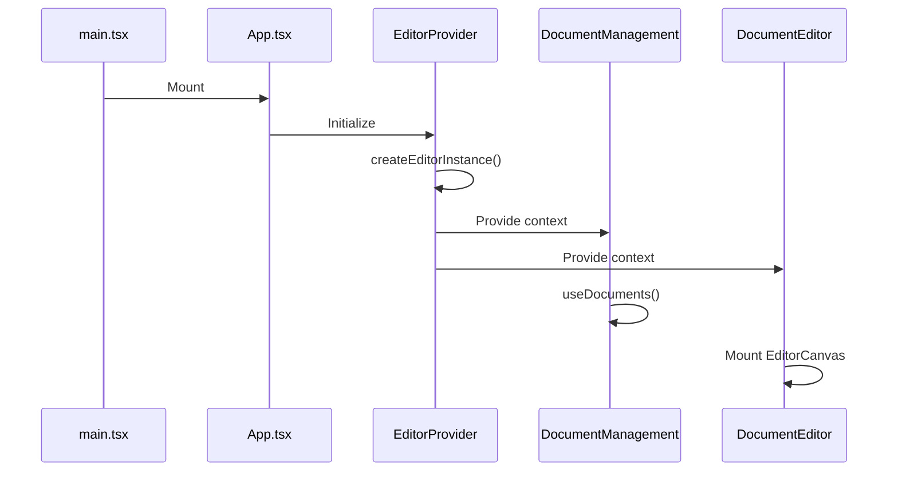
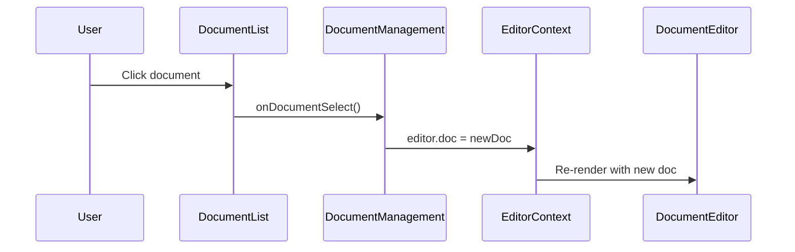
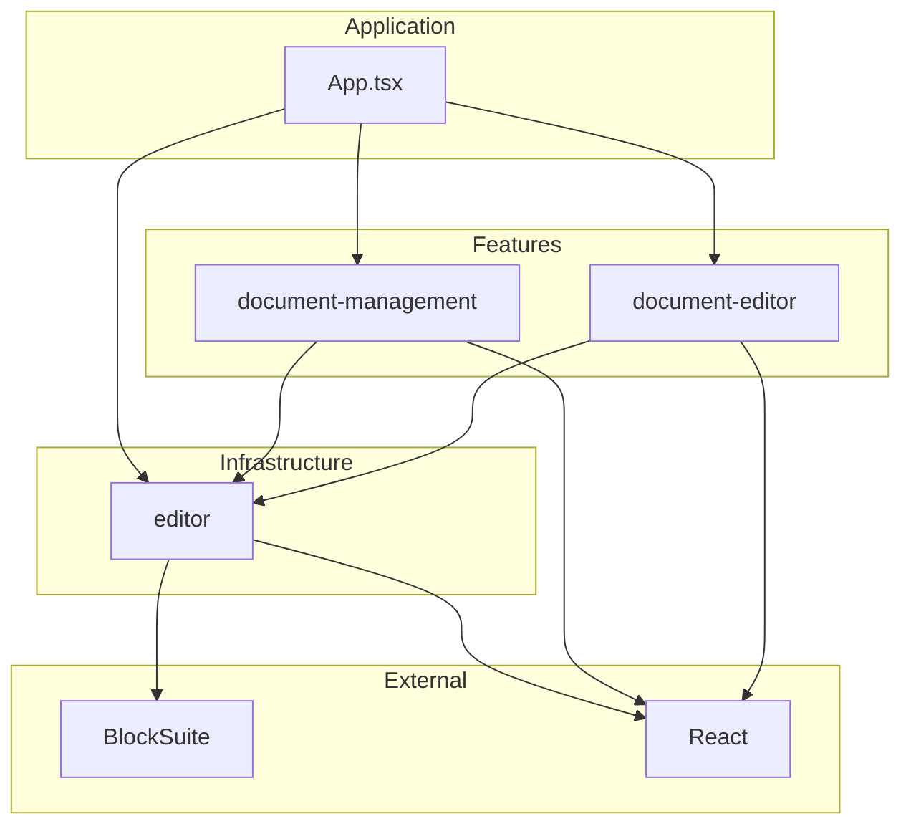
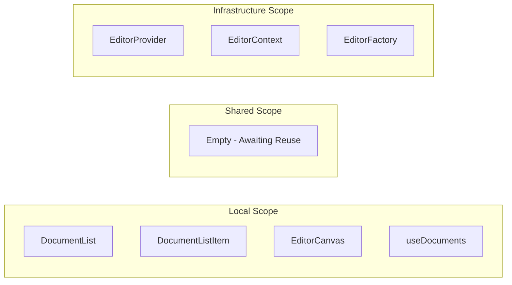

# Project Structure

Visual guide to codebase organization.

---

**[← Architecture](./ARCHITECTURE.md)** | **[Back to README](./README.md)**

---

## Directory Tree

```
blocksuite-react/
├── src/
│   ├── features/
│   │   ├── document-management/
│   │   │   ├── document-management.tsx
│   │   │   ├── components/
│   │   │   │   ├── document-list.tsx
│   │   │   │   └── document-list-item.tsx
│   │   │   ├── hooks/
│   │   │   │   └── use-documents.ts
│   │   │   └── services/
│   │   │       └── document-service.ts
│   │   └── document-editor/
│   │       ├── document-editor.tsx
│   │       └── components/
│   │           └── editor-canvas.tsx
│   ├── infrastructure/
│   │   └── editor/
│   │       ├── editor-provider.tsx
│   │       ├── editor-context.ts
│   │       ├── editor-factory.ts
│   │       ├── models.ts
│   │       └── index.ts
│   ├── shared/
│   ├── App.tsx
│   ├── main.tsx
│   └── index.css
├── ARCHITECTURE.md
├── STRUCTURE.md
├── README.md
└── package.json
```

---

## Feature Breakdown

### Document Management



**Responsibilities:**
- Create new documents
- List all documents
- Select documents for editing
- Rename documents
- Delete documents
- Display active document state

---

### Document Editor



**Responsibilities:**
- Render BlockSuite editor
- Mount editor to DOM
- Handle editor lifecycle

---

## Data Flow

### Application Lifecycle



### Document Selection Flow



---

## Import Graph

### Dependency Layers



### Import Rules

| Layer | Can Import From |
|-------|----------------|
| Features | Infrastructure, Shared, External |
| Infrastructure | External only |
| Shared | External only |
| App | All layers |

**Forbidden:**
- ❌ Infrastructure → Features
- ❌ Feature A → Feature B
- ❌ Shared → Features

---

## Scope Visualization



---

## File Metrics

| Directory | Files | Purpose |
|-----------|-------|---------|
| `features/document-management/` | 4 | Document listing & selection |
| `features/document-editor/` | 2 | Content editing |
| `infrastructure/editor/` | 5 | BlockSuite integration |
| `shared/` | 0 | Awaiting multi-feature reuse |

---

**[← Architecture](./ARCHITECTURE.md)** | **[Back to README](./README.md)**
