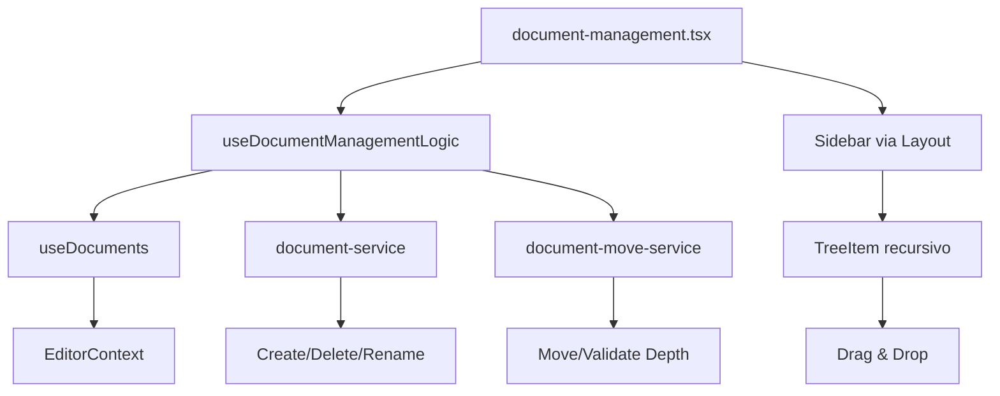
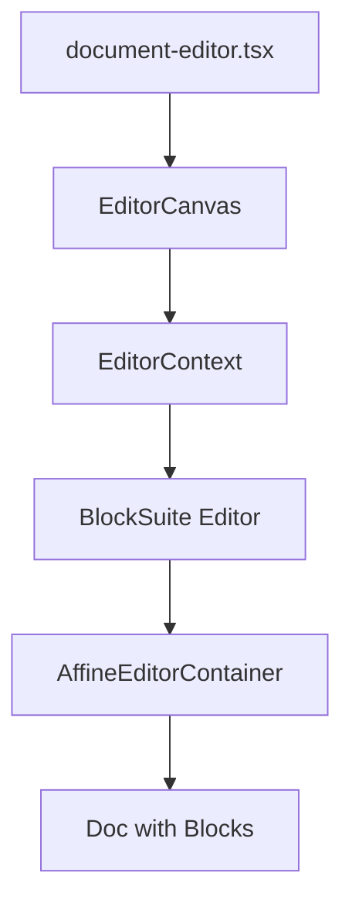
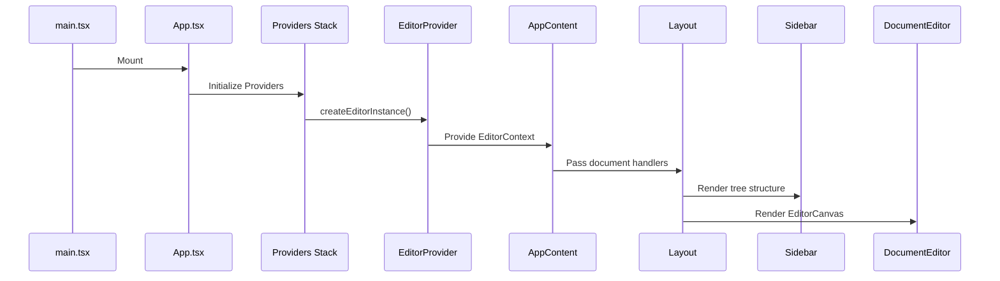
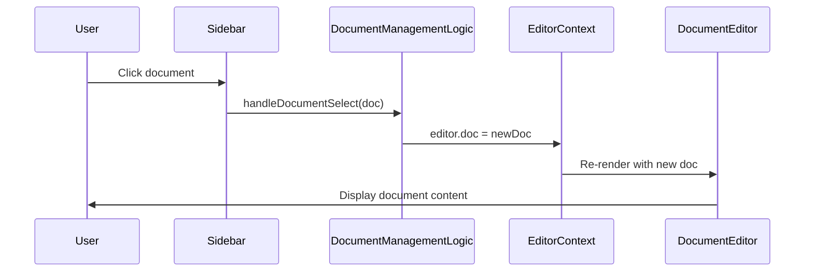
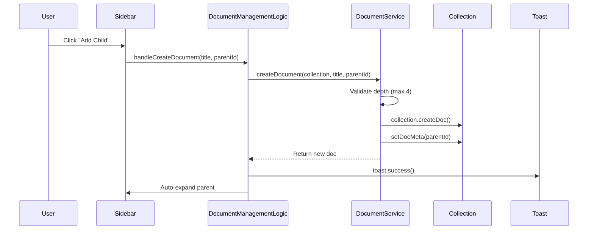
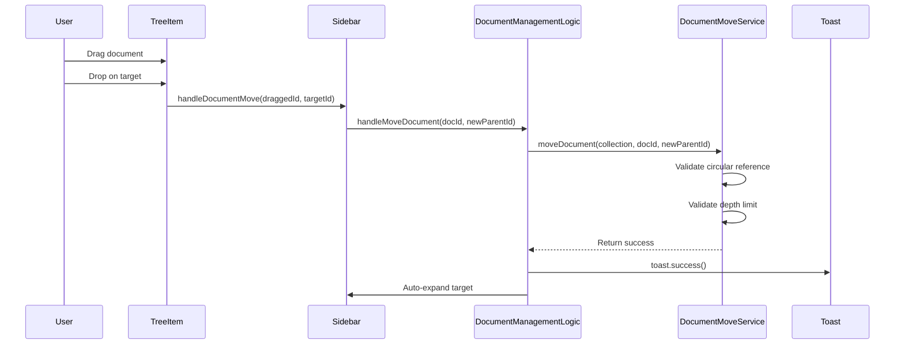
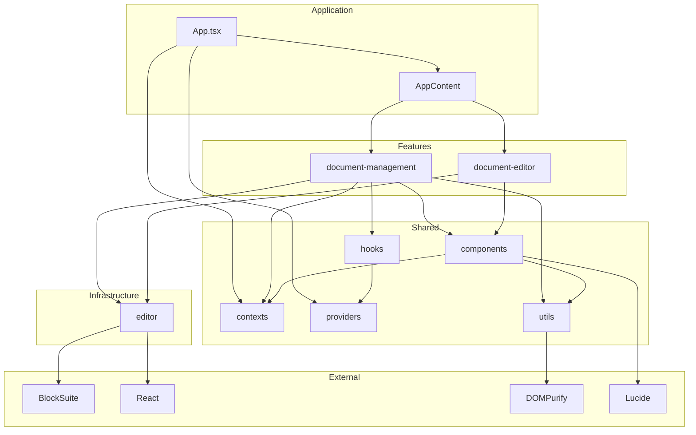
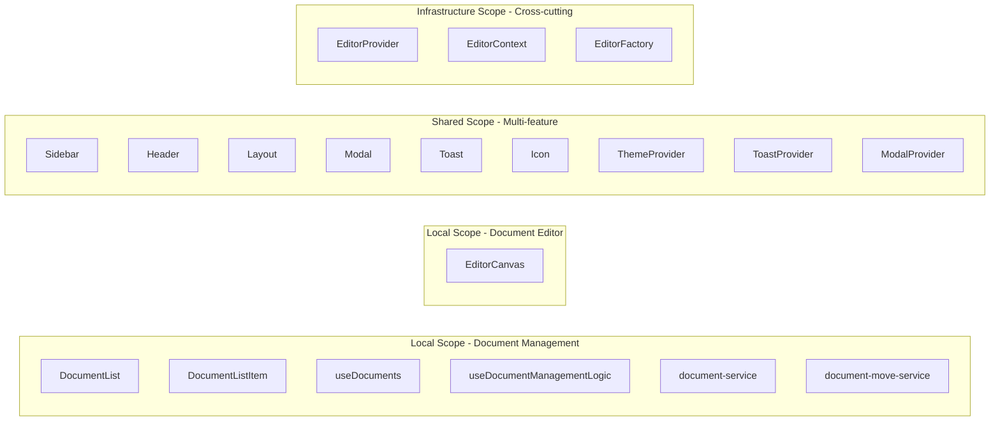
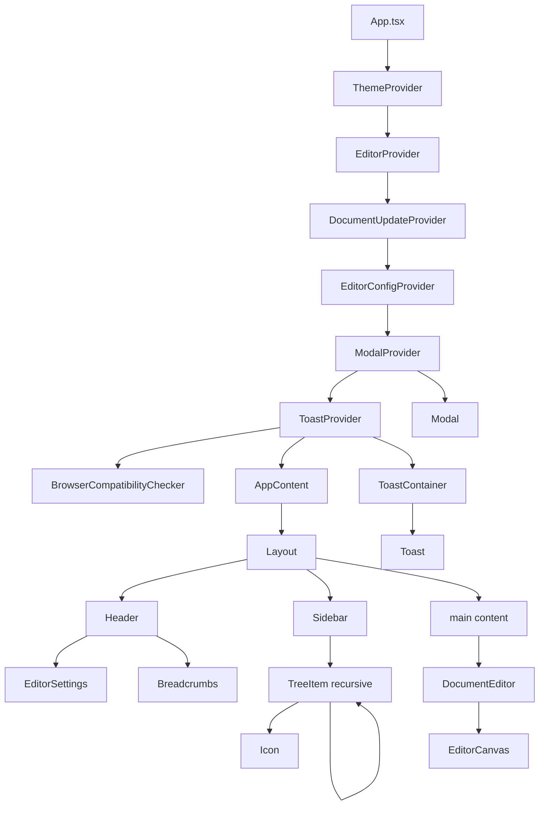

# Project Structure

Visual guide to codebase organization.

---

**[← Architecture](./ARCHITECTURE.md)** | **[Back to README](./README.md)**

---

## Directory Tree

```
blocksuite-react/
├── src/
│   ├── features/
│   │   ├── document-management/
│   │   │   ├── document-management.tsx
│   │   │   ├── components/
│   │   │   │   ├── document-list.tsx
│   │   │   │   └── document-list-item.tsx
│   │   │   ├── hooks/
│   │   │   │   ├── use-documents.ts
│   │   │   │   └── use-document-management-logic.ts
│   │   │   ├── services/
│   │   │   │   ├── document-service.ts
│   │   │   │   └── document-move-service.ts
│   │   │   └── models.ts
│   │   └── document-editor/
│   │       ├── document-editor.tsx
│   │       ├── components/
│   │       │   └── editor-canvas.tsx
│   │       └── models.ts
│   ├── infrastructure/
│   │   └── editor/
│   │       ├── editor-provider.tsx
│   │       ├── editor-context.ts
│   │       ├── editor-factory.ts
│   │       ├── models.ts
│   │       └── index.ts
│   ├── shared/
│   │   ├── components/
│   │   │   ├── sidebar.tsx
│   │   │   ├── header.tsx
│   │   │   ├── layout.tsx
│   │   │   ├── app-content.tsx
│   │   │   ├── modal.tsx
│   │   │   ├── toast.tsx
│   │   │   ├── toast-container.tsx
│   │   │   ├── icon.tsx
│   │   │   ├── editor-settings.tsx
│   │   │   └── browser-compatibility-checker.tsx
│   │   ├── contexts/
│   │   │   ├── theme-provider.tsx
│   │   │   ├── theme-context.ts
│   │   │   ├── theme-models.ts
│   │   │   ├── editor-config-context.tsx
│   │   │   └── document-update-context.tsx
│   │   ├── hooks/
│   │   │   ├── use-toast.ts
│   │   │   └── use-modal.ts
│   │   ├── providers/
│   │   │   ├── toast-provider.tsx
│   │   │   └── modal-provider.tsx
│   │   ├── utils/
│   │   │   ├── sanitize.ts
│   │   │   └── validation.ts
│   │   ├── models/
│   │   │   ├── document.types.ts
│   │   │   └── toast.types.ts
│   │   └── icons/
│   │       └── icon-registry.ts
│   ├── styles/
│   │   ├── app.css
│   │   └── overrides.css
│   ├── App.tsx
│   ├── main.tsx
│   └── index.css
├── public/
│   └── capture.png
├── ARCHITECTURE.md
├── STRUCTURE.md
├── README.md
├── package.json
├── vite.config.ts
├── tsconfig.json
└── biome.json
```

---

## Feature Breakdown

### Document Management



**Responsibilities:**
- Create documents (root or nested)
- Hierarchical tree structure (max 4 levels)
- Drag & drop document reorganization
- Select documents for editing
- Rename documents with title sync
- Delete documents (with protection)
- Move documents between levels
- Validate circular references
- Navigate via internal links

**Key Files:**
- `hooks/use-document-management-logic.ts` - Orchestrates all document operations
- `hooks/use-documents.ts` - Fetches documents from collection
- `services/document-service.ts` - CRUD operations + BlockSuite bug fix
- `services/document-move-service.ts` - Move validation and execution
- `components/document-list.tsx` - Document list renderer
- `components/document-list-item.tsx` - Individual document item

---

### Document Editor



**Responsibilities:**
- Render BlockSuite editor
- Mount editor to DOM
- Handle editor lifecycle
- Display active document content

**Key Files:**
- `document-editor.tsx` - Container component
- `components/editor-canvas.tsx` - Editor mounting logic

---

## Data Flow

### Application Lifecycle



### Document Selection Flow



### Document Creation Flow



### Drag & Drop Flow



---

## Import Graph

### Dependency Layers



### Import Rules

| Layer | Can Import From |
|-------|----------------|
| Features | Infrastructure, Shared, External |
| Infrastructure | External only |
| Shared | External only |
| App | All layers |

**Forbidden:**
- ❌ Infrastructure → Features
- ❌ Feature A → Feature B
- ❌ Shared → Features

---

## Scope Visualization



---

## File Metrics

| Directory | Files | Lines | Purpose |
|-----------|-------|-------|---------|
| `features/document-management/` | 7 | ~500 | Document CRUD + hierarchy |
| `features/document-editor/` | 3 | ~50 | Content editing |
| `infrastructure/editor/` | 5 | ~100 | BlockSuite integration |
| `shared/components/` | 11 | ~800 | Reusable UI components |
| `shared/contexts/` | 5 | ~150 | React contexts |
| `shared/hooks/` | 2 | ~80 | Custom hooks |
| `shared/providers/` | 2 | ~80 | Context providers |
| `shared/utils/` | 2 | ~50 | Utilities |
| `shared/models/` | 2 | ~50 | TypeScript types |
| `styles/` | 2 | ~600 | Global CSS |

**Total**: 44 TypeScript/TSX files

---

## Component Hierarchy



---

**[← Architecture](./ARCHITECTURE.md)** | **[Back to README](./README.md)**
